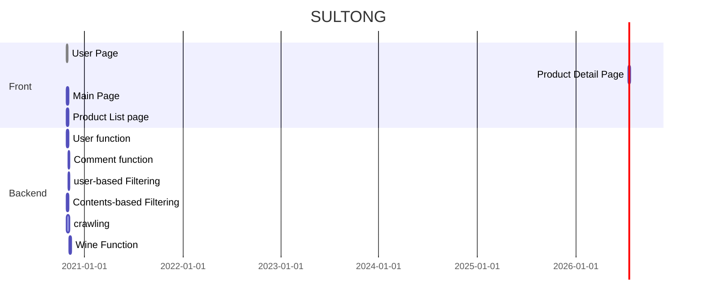

[TOC]

# 1. Etch Stack

# 2. Function

- 회원 기능
  - 회원 관련 CRUD 
  - 회원가입 정보
    - 이메일
    - 비밀번호
    - 성별
    - 나이
- 와인 선호목록 관리
  - 회원이 마셔봤거나 마시고싶은 와인의 목록 CRUD
- 와인 추천
  - 컨텐츠 기반 필터링과 사용자 기반 필터링 사용

# 3. Gantt chart

# 4. Git Convention

### 1. Git Branch Strategy

#### 1. Branch Rule

Branch 명은 다음과 같은 규칙으로 생성 및 관리한다.

- master: 제품으로 출시될 수 있는 브랜치
- develop: 다음 출시 버전을 개발하는 브랜치
- feature: 기능을 개발하는 브랜치
- release: 이번 출시 버전을 준비하는 브랜치
- hotfix: 출시된 버전에서 발생한 버그를 수정하는 브랜치

#### 2. Process

다음과 같은 절차로 진행한다.

1. `master` 브랜치에서 `develop` 브랜치를 분기하여 `develop` 브랜치에서 개발을 진행한다.
2. 기능 구현이 있는 경우 `develop` 브랜치에서 `feature/{기능명}` 브랜치를 분기한다. ex) `feature/frontend`
3. `feat/{기능명}`브랜치에서 `{기능명}/{상세내용}` 브랜치를 분기한다. ex) `frontend/login`
4. 작업 중 다른 브랜치에서 완료된 기능(`develop`브랜치로 merge가 완료된 기능)이 필요하다면 현재 브랜치로 `develop` 브랜치를 merge한다.
5. merge는 역순으로 진행하되, 먼저 다른 기능 개발이 완료되었다면 현재 브랜치에 merge한 후 진행한다.
6. 배포할 기능 구현이 완료되었다면 `develop` 브랜치에서 `release-{배포 버전}` 브랜치를 분기한다. ex) `release-1.0.0`
7. `release-{배포 버전}` 가 만들어지면 집중적으로 버그를 수정한다.
8. `release-{배포 버전}` 브랜치에서 QA 를 진행하고, 발생한 버그는 `release-{배포 버전}` 브랜치에 직접 반영한다.
9. 테스트가 완료되면 `release-{배포 버전}` 브랜치를 `master`와 `develop`에 머지한다.
10. 배포된 버전에 버그가 발생하였다면 `master` 브랜치에서 `hotfix` 브랜치를 분기하여 버그를 수정한다.
11. `master`브랜치와 `develop`브랜치 를 메인 브랜치로 항상 유지하고, 모든 브랜치는 생성 후 각 역할이 종료되면 삭제하는 것을 규칙으로 한다.

### 2. Git Commit Rule

#### 1. Commit Type

- \[feat]: 새로운 기능 추가
- \[fix]: 버그 수정
- \[docs]: 문서 수정
- \[style]: 코드 포맷팅, 세미콜론 누락 등 (동작에 영향을 주지 않는 코드)
- \[refactor]: 코드 리팩토링
- \[test]: 테스트 코드 추가
- \[chore]: 빌드 업무 수정, 패키지 매니저 설정 등 위에 해당되지 않는 모든 변경

#### 2. Subject

- 제목은 50자를 넘기지 않는다.
- 첫 글자는 대문자로 작성한다.
- 시제 없이 명령문으로 작성한다.

# 5. Code conventions